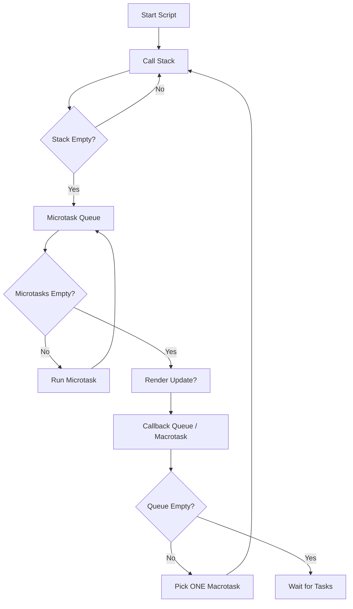

# JavaScript Event Loop Mastery

A comprehensive guide to understanding how JavaScript executes code, handles asynchronous operations, and manages the Event Loop.

## 1. Core Concepts

JavaScript is **single-threaded**, meaning it can only do one thing at a time. It has a single **Call Stack**.

### The Call Stack
- A LIFO (Last In, First Out) data structure.
- Stores the execution context of the functions being run.
- When a function is called, it's pushed onto the stack.
- When a function returns, it's popped off the stack.

### Web APIs (The Browser Environment)
- JavaScript runtime (V8) is single-threaded, but the browser provides extra threads (Web APIs) to handle tasks like:
    - DOM events
    - `setTimeout` / `setInterval`
    - `fetch` / AJAX requests
- These run in the **background** without blocking the main thread.

### The Callback Queue (Task Queue / Macrotask Queue)
- Holds callbacks from Web APIs (e.g., `setTimeout`, `setInterval`).
- First In, First Out (FIFO).
- Examples: `setTimeout`, `setInterval`, `setImmediate`, I/O, UI rendering.

### The Microtask Queue
- Similar to the Callback Queue but has **higher priority**.
- Holds callbacks from:
    - `Promise` handlers (`.then`, `.catch`, `.finally`).
    - `queueMicrotask`.
    - `MutationObserver`.
- **CRITICAL**: The Event Loop processes *all* microtasks before moving to the next macrotask.

## 2. The Event Loop Algorithm

The Event Loop's job is simple:
1. **Execute Script**: Run synchronous code on the Call Stack until empty.
2. **Microtasks**: Check the Microtask Queue. Execute *all* tasks until the queue is empty.
3. **Render**: The browser may update the UI (rendering).
4. **Macrotask**: Pick *one* task from the Callback Queue and push it to the Call Stack.
5. **Repeat**.

## Visual Representation

## 3. Execution Order Rules

1. **Synchronous code** runs first.
2. **Microtasks** (Promises, `queueMicrotask`) run immediately after synchronous code, *before* any Macrotasks and *before* re-rendering.
3. **Macrotasks** (`setTimeout`, `setInterval`) run next.

---

## 4. Common Pitfalls / Interview Patterns

### Why does `setTimeout(fn, 0)` not run immediately?
It sets a timer for 0ms, but the callback is pushed to the **Macrotask Queue**. It must wait for the Call Stack to clear *and* all Microtasks to finish.

### Infinite Loop in Microtasks?
If you keep scheduling microtasks (e.g., recursive Promise resolution), execution will never reach the Macrotask queue or UI rendering, causing the page to freeze.
