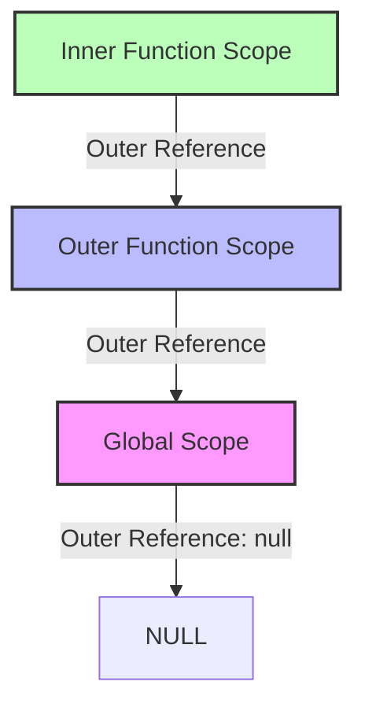

# 🔗 Scope Chaining Mastery: A Senior Developer's Guide

> "Understanding scope is not just about knowing where variables live; it's about understanding how the JavaScript engine thinks."

This guide delves into the internal mechanics of JavaScript's scope scope chain, crucial for senior-level interviews and architectural decisions.

## 📚 Core Concepts

### 1. Execution Context (The Container)
Every time JavaScript code runs, it runs inside an **Execution Context**.
- **Global Execution Context (GEC):**Created when the script starts.
- **Function Execution Context (FEC):** Created whenever a function is **invoked**.

Each context has two phases:
1.  **Creation Phase:** Memory allocation (hoisting), scope chain creation, `this` binding.
2.  **Execution Phase:** Code execution, variable assignment.

### 2. Lexical Environment (The Storage)
A Lexical Environment is a data structure acting as a map for variables and functions. It consists of:
1.  **Environment Record:** The actual storage of variables (`let`, `const`, `var`, functions).
2.  **Outer Environment Reference:** A pointer to the parent's lexical environment. **This pointer is the physical link that creates the Scope Chain.**

### 3. The Scope Chain (The Lookup Path)
The Scope Chain is simply a list of all Lexical Environments accessible to the currently executing code.
When you ask for a variable `x`:
1.  JS looks in the **current** Environment Record.
2.  If not found, it travels up the **Outer Environment Reference** to the parent.
3.  It repeats this until it reaches the Global Scope.
4.  If still not found: `ReferenceError`.

---

## 🔍 Lexical Scoping (Static Scope)
JavaScript uses **Lexical Scoping** (or Static Scoping).
*   **Lexical:** Related to "writing".
*   **Rule:** A function's scope is determined by **where it is defined (physically written)**, NOT where it is called.

> **Senior Interview Tip:** "Closures exist because functions remember the Lexical Environment in which they were *created*, no matter where they are executed later."

---

## 🛠️ Deep Dive: The Lookup Process

1.  **LHS vs RHS Loopkup:**
    *   **LHS (Left-Hand Side):** Finding a variable container to *set* a value. (`a = 2`)
    *   **RHS (Right-Hand Side):** Finding a value to *retrieve* it. (`console.log(a)`)

2.  **Shadowing:**
    *   If an inner scope declares a variable with the same name as an outer scope, the inner one "shadows" (hides) the outer one. Access to the outer one is lost within that inner scope.

---

## ⚠️ Common Pitfalls

1.  **`var` vs `let`/`const`**
    *   `var`: Function-scoped. Ignores block `{}` boundaries (except functions).
    *   `let`/`const`: Block-scoped. Respects `{}` boundaries.

2.  **Temporal Dead Zone (TDZ)**
    *   Variables declared with `let` and `const` exist in the scope from the start of the block but are uninitialized. Accessing them before the declaration line throws a `ReferenceError`.

3.  **Global Polluting**
    *   Assigning to an undeclared variable in non-strict mode creates a property on the global object (window). `function foo() { x = 10; }` -> `window.x` exists! Always use `"use strict"`.

---

## 🚀 How to Use This Repo
Run the examples to see these concepts in action:
1.  `01_basics_lexical_execution.js`: writing vs calling.
2.  `02_scope_chain_lookup.js`: the chain in action & shadowing.
3.  `03_block_vs_function_scope.js`: nuances of `var`/`let`.
4.  `04_closures_interaction.js`: how closures leverage the chain.
5.  `05_senior_interview_tricky.js`: test your knowledge.
